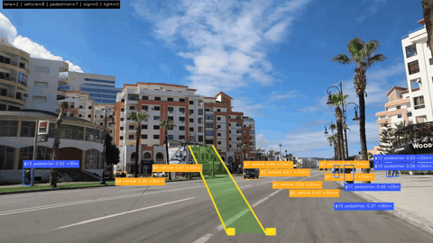

# adas-perception

`adas-perception` は、単眼カメラ画像/動画から車線・車両・歩行者・標識・信号候補を検出して可視化する、デモ重視のPython製ADAS認識OSSです。



*(7-way WBF online config 出力。Pexels CC0 dashcam: [Driving In The City - mokhtar akel](https://www.pexels.com/video/driving-in-the-city-1578970/))*

## 今できること

- OpenCVによる車線候補の検出と走行レーン領域の描画
- PyTorch/TorchVisionのCOCO事前学習モデルによる車両・歩行者検出
- Ultralytics YOLOバックエンドによる軽量な物体検出
- 複数物体検出器の合成実行
- OpenCVの色/形状ヒューリスティックによる標識候補の検出と簡易ラベル付け
- OpenCVの色/形状ヒューリスティックによる赤・黄・緑の信号候補検出
- 動画向けの車線平滑化
- 車両・歩行者への簡易トラッキングID付与
- 車両・歩行者bboxからの粗い単眼距離推定
- 画像1枚への可視化出力
- 動画へのフレーム単位の可視化出力
- 認識結果のJSON出力
- JSON出力の簡易集計
- 推論速度の簡易ベンチマーク
- 複数設定の比較ベンチマーク
- BDD100K形式の公開データ評価
- 公開データ評価結果の比較
- BDD100K評価のTP/FP/FNエラーサンプル可視化
- BDD100K評価エラーのサイズ別/種別別集計
- BDD100K評価のbboxサイズ別メトリクス
- BDD100Kでの物体検出モデル/score threshold/クラス別score thresholdスイープ
- BDD100K公式train/val splitを使ったYOLO学習データexport
- BDD100K validation mirrorのeven/odd非重複split exportと追加学習実験
- BDD100K評価エラーと小物体を使ったYOLO学習データの重み付けexport
- BDD100K小物体を拡大して見せるtrain専用object crop export
- BDD100K小物体をfull-frame文脈へ戻すtrain専用copy-paste export
- 保存済みBDD100K予測JSONを使った高速なscore threshold再評価
- 保存済みBDD100K予測JSONをWeighted Box Fusionで融合するoffline accuracy ceiling
- ブラウザだけで操作するheadless friendly web demo (gradio、Jetson想定)
- UltralyticsバックエンドでのTest-Time Augmentation (水平反転+multi-scale)
- BDD100Kでfine-tuneした単一YOLOによる車両・歩行者・標識・信号候補検出
- YAML設定によるしきい値、モデル、デバイス、表示設定の変更

## ディレクトリ構成

```text
adas-perception/
├── adas_perception/
│   ├── config.py              # YAML設定の読み込み
│   ├── distance.py            # bboxベースの粗い距離推定
│   ├── lane_smoothing.py      # 動画向け車線平滑化
│   ├── pipeline.py            # 最小推論パイプライン
│   ├── serialization.py       # JSON出力
│   ├── tracking.py            # 簡易IoUトラッキング
│   ├── types.py               # 検出結果のデータ型
│   ├── visualization.py       # OpenCVによる描画
│   └── detectors/
│       ├── lane.py            # 車線候補検出
│       ├── objects.py         # TorchVision/Ultralytics物体検出
│       ├── signs.py           # 色/形状ベースの標識候補検出
│       └── traffic_lights.py  # 色/形状ベースの信号候補検出
├── configs/
│   ├── accurate.yaml          # 精度寄りデモ向け上書き設定
│   ├── bdd100k_eval.yaml      # BDD100K評価向け上書き設定
│   ├── bdd100k_sign_light_yolo_finetuned.yaml # BDD100K標識/信号fine-tune評価設定
│   ├── bdd100k_torchvision_only.yaml # BDD100K切り分け評価設定
│   ├── bdd100k_yolo_ensemble.yaml # 車両/歩行者YOLO + 標識/信号fine-tune YOLO設定
│   ├── bdd100k_yolo_finetuned_all_even_class_balanced_1024_1ep.yaml # class-aware oversampling追加学習実験設定
│   ├── bdd100k_yolo_finetuned_all_even_class_balanced_1024_1ep_tuned.yaml # class-aware oversampling + threshold tuning実験設定
│   ├── bdd100k_yolo_finetuned_all_even_1024_1ep.yaml # even split追加学習YOLO実験設定
│   ├── bdd100k_yolo_finetuned_all_even_object_crops_1024_1ep.yaml # 小物体crop追加学習実験設定
│   ├── bdd100k_yolo_finetuned_all_even_object_crops_1024_1ep_tuned.yaml # 小物体crop + threshold tuning実験設定
│   ├── bdd100k_yolo_finetuned_all_even_copy_paste_1024_1ep.yaml # 小物体copy-paste追加学習実験設定
│   ├── bdd100k_yolo_finetuned_all_even_copy_paste_1024_1ep_tuned.yaml # copy-paste + threshold tuning実験設定
│   ├── bdd100k_yolo_finetuned_all_even_copy_paste_feather_1024_1ep.yaml # feather copy-paste追加学習実験設定
│   ├── bdd100k_yolo_finetuned_all_even_copy_paste_feather_1024_1ep_tuned.yaml # feather copy-paste + threshold tuning実験設定
│   ├── bdd100k_yolo_finetuned_all_even_copy_paste_light_1024_1ep.yaml # 小物体copy-paste比率低め追加学習実験設定
│   ├── bdd100k_yolo_finetuned_all_even_copy_paste_light_1024_1ep_tuned.yaml # copy-paste比率低め + threshold tuning実験設定
│   ├── bdd100k_yolo_finetuned_all.yaml # BDD100K全ADAS対象fine-tune YOLO設定
│   ├── bdd100k_yolo_finetuned_all_hard_small.yaml # hard/small再学習実験YOLO設定
│   ├── bdd100k_yolo_finetuned_all_hard_small_tuned.yaml # hard/small再学習 + threshold tuning実験設定
│   ├── bdd100k_yolo_finetuned_all_tuned.yaml # クラス別score threshold調整済み単一YOLO設定
│   ├── bdd100k_yolo_finetuned_all_tuned_split.yaml # split評価で選んだ単一YOLO設定
│   ├── bdd100k_yolo_finetuned_all_tuned_split_img1024_kind_tuned.yaml # 1024px + threshold再調整設定 (高速demo用)
│   ├── bdd100k_yolo_finetuned_all_tuned_split_img1024_kind_tuned_cache_low.yaml # 1024px no-TTA WBF用低しきい値cache設定
│   ├── bdd100k_yolo_finetuned_all_tuned_split_img1024_kind_tuned_tta_tuned.yaml # 1024px + TTA + threshold再調整 (精度参照)
│   ├── bdd100k_yolo_finetuned_all_tuned_split_img1024_kind_tuned_tta_tuned_tiny.yaml # 1024px + TTA + threshold再調整 + tiny size override (single-config精度優先)
│   ├── bdd100k_yolo_finetuned_all_tuned_split_img1024_kind_tuned_tta_cache_low.yaml # 1024px TTA WBF用低しきい値cache設定
│   ├── bdd100k_yolo_finetuned_all_tuned_split_img960_tta_cache_low.yaml # 960px TTA WBF用低しきい値cache設定
│   ├── bdd100k_yolo_finetuned_all_tuned_split_img1280_tta_cache_low.yaml # 1280px TTA WBF用低しきい値cache設定
│   ├── bdd100k_yolo_finetuned_all_tuned_split_img1536_tta_cache_low.yaml # 1536px TTA WBF用低しきい値cache設定
│   ├── bdd100k_yolo_finetuned_all_tuned_split_img1792_tta_cache_low.yaml # 1792px TTA WBF用低しきい値cache設定
│   ├── bdd100k_yolo_wbf7_perkind_iou_online.yaml # online 7-way WBF融合設定 (精度優先、single-config、現行ベスト)
│   ├── bdd100k_yolo_finetuned_all_tuned_split_img1024_kind_tuned_tiles_tiny.yaml # 1024px + tiny tile実験設定
│   ├── bdd100k_yolo_finetuned_all_tuned_split_img1024_size_tuned_tiny_recall.yaml # 1024px + size-aware threshold実験設定
│   ├── bdd100k_yolo_finetuned_all_tuned_split_img1024.yaml # split-tuned単一YOLOの1024px入力評価設定
│   ├── bdd100k_yolo_finetuned_all_tuned_split_img1280.yaml # split-tuned単一YOLOの1280px入力スポット評価設定
│   ├── bdd100k_yolo_finetuned_all_tuned_split_img960.yaml # split-tuned単一YOLOの960px入力評価設定
│   ├── bdd100k_yolo.yaml      # YOLOベースのBDD100K評価設定
│   ├── cpu.yaml               # CPU向け上書き設定
│   ├── default.yaml           # v0デフォルト設定
│   ├── fast.yaml              # 高速デモ向け上書き設定
│   ├── no_objects.yaml        # TorchVisionなしの上書き設定
│   └── yolo.yaml              # YOLOベースのデモ設定
├── scripts/
│   ├── analyze_bdd100k_errors.py # BDD100K評価エラーの集計レポート
│   ├── benchmark.py           # レイテンシ/FPS計測
│   ├── check_bdd100k.py       # BDD100K配置チェック
│   ├── compare_benchmarks.py  # 複数設定の比較
│   ├── compare_evaluations.py # 評価結果JSONの比較
│   ├── demo_image.py          # 画像デモ
│   ├── demo_video.py          # 動画デモ
│   ├── evaluate_bdd100k.py    # BDD100K形式ラベルでの評価
│   ├── evaluate_json.py       # JSON出力の簡易集計
│   ├── export_bdd100k_yolo.py # BDD100KからYOLO学習形式へexport
│   ├── fuse_bdd100k_predictions.py # 複数予測JSONをWeighted Box Fusionで融合
│   ├── web_demo.py            # ブラウザ可視化 (gradio、Jetson/headless 向け)
│   ├── prepare_bdd100k.py     # 公式BDD100K zipの展開/検証
│   ├── run_bdd100k_official_train.sh # 公式train split一括学習パイプライン
│   ├── sweep_bdd100k_cached_predictions.py # 保存済み予測で閾値を高速再評価
│   ├── sweep_bdd100k_thresholds.py # BDD100Kモデル/閾値スイープ
│   └── visualize_bdd100k_errors.py # BDD100K評価エラーの画像化
├── ROADMAP.md
├── requirements-bdd100k.txt
├── requirements-yolo.txt
├── requirements.txt
└── pyproject.toml
```

## セットアップ

Python 3.10以上を想定しています。

```bash
python3 -m venv .venv
source .venv/bin/activate
pip install -U pip
pip install -r requirements.txt
```

CUDA版のPyTorchを使う場合は、環境に合うPyTorch/TorchVisionを先にインストールしてから `pip install -r requirements.txt` を実行してください。

BDD100K公式ツールキットも使う場合:

```bash
pip install -r requirements-bdd100k.txt
```

YOLOバックエンドも使う場合:

```bash
pip install -r requirements-yolo.txt
```

## 実行コマンド

画像:

```bash
python scripts/demo_image.py --input path/to/road.jpg --output outputs/road_adas.jpg
```

動画:

```bash
python scripts/demo_video.py --input path/to/drive.mp4 --output outputs/drive_adas.mp4
```

CPUで明示実行:

```bash
python scripts/demo_image.py --input path/to/road.jpg --device cpu
```

ブラウザ可視化 (gradioベース、headless / Jetson 想定):

```bash
.venv/bin/pip install gradio
python scripts/web_demo.py --port 7860
# `http://<host>:7860` を開くと、画像/動画/Webカメラから推論結果を見られます。
# Autoware の RViz と違って X11/ROS 不要なので、Jetson Nano に挿して LAN の別 PC からアクセスする運用に向きます。
```

可視化画像とJSONを同時に保存:

```bash
python scripts/demo_image.py \
  --input path/to/road.jpg \
  --output outputs/road_adas.jpg \
  --json-output outputs/road_adas.json
```

動画のフレームごとの認識結果をJSONに保存:

```bash
python scripts/demo_video.py \
  --input path/to/drive.mp4 \
  --output outputs/drive_adas.mp4 \
  --json-output outputs/drive_adas.json
```

JSON出力を集計:

```bash
python scripts/evaluate_json.py --input outputs/drive_adas.json
```

集計結果もJSONで保存:

```bash
python scripts/evaluate_json.py \
  --input outputs/drive_adas.json \
  --output outputs/drive_eval.json
```

画像入力でベンチマーク:

```bash
python scripts/benchmark.py \
  --input path/to/road.jpg \
  --repeat 30 \
  --device cpu
```

動画入力でベンチマーク:

```bash
python scripts/benchmark.py \
  --input path/to/drive.mp4 \
  --max-frames 120 \
  --output outputs/drive_benchmark.json
```

複数設定を比較:

```bash
python scripts/compare_benchmarks.py \
  --input path/to/drive.mp4 \
  --configs configs/default.yaml configs/fast.yaml configs/no_objects.yaml \
  --max-frames 120 \
  --output outputs/drive_compare.json
```

BDD100K形式の公開データで評価:

Hugging Face上のBDD100K validation mirrorからval画像とDetectionラベルを取得して、BDD100K/Scalabel風の `det_val.json` に変換します。

```bash
python scripts/prepare_bdd100k.py \
  --download-val \
  --data-root data/bdd100k
```

公式サイトから `100K Images` と `Detection 2020 Labels` を手動取得済みの場合は、ダウンロードディレクトリを指定できます。

```bash
python scripts/prepare_bdd100k.py \
  --download-dir ~/Downloads \
  --data-root data/bdd100k
```

```bash
python scripts/check_bdd100k.py \
  --images-root data/bdd100k/images/100k/val \
  --labels data/bdd100k/labels/det_20/det_val.json
```

```bash
python scripts/evaluate_bdd100k.py \
  --images-root data/bdd100k/images/100k/val \
  --labels data/bdd100k/labels/det_20/det_val.json \
  --config configs/bdd100k_eval.yaml \
  --max-images 500 \
  --output outputs/bdd100k_val_eval.json
```

複数の評価結果を比較:

```bash
python scripts/compare_evaluations.py \
  --reports outputs/bdd100k_eval_030.json outputs/bdd100k_eval_020.json \
  --names score030 score020 \
  --output outputs/bdd100k_eval_compare.json \
  --markdown-output outputs/bdd100k_eval_compare.md \
  --csv-output outputs/bdd100k_eval_compare.csv
```

BDD100Kでscore thresholdをまとめて試す:

```bash
python scripts/sweep_bdd100k_thresholds.py \
  --images-root data/bdd100k/images/100k/val \
  --labels data/bdd100k/labels/det_20/det_val.json \
  --base-config configs/bdd100k_eval.yaml \
  --score-thresholds 0.20 0.30 0.40 0.50 \
  --max-images 500 \
  --output-dir outputs/bdd100k_sweep
```

BDD100Kで複数モデルとscore thresholdをまとめて試す:

```bash
python scripts/sweep_bdd100k_thresholds.py \
  --images-root data/bdd100k/images/100k/val \
  --labels data/bdd100k/labels/det_20/det_val.json \
  --base-config configs/bdd100k_eval.yaml \
  --models ssdlite320_mobilenet_v3_large retinanet_resnet50_fpn_v2 fasterrcnn_resnet50_fpn_v2 \
  --score-thresholds 0.20 0.30 0.40 \
  --max-images 500 \
  --markdown \
  --output-dir outputs/bdd100k_model_sweep
```

物体検出モデルの初回実行時にはTorchVisionの事前学習重みを取得します。ネットワークが使えない環境では、重みを事前にキャッシュするか、動作確認だけなら `--no-objects` で車線/標識候補のみを実行できます。

YOLOバックエンドで評価する場合:

```bash
python scripts/evaluate_bdd100k.py \
  --images-root data/bdd100k/images/100k/val \
  --labels data/bdd100k/labels/det_20/det_val.json \
  --config configs/bdd100k_yolo.yaml \
  --device cuda \
  --max-images 100 \
  --output outputs/bdd100k_yolo_100.json
```

## 設定

デフォルト設定は [configs/default.yaml](configs/default.yaml) にあります。

- `lane`: Canny/Hough/ROI などの車線検出パラメータに加え、`color_mask.enabled: true` で HSV ベースの白/黄ライン抽出を Canny edges に AND し、影や縁石の誤検出を抑制します。candidates の slope は MAD ベースの外れ値除去で robust にします
- `objects`: 検出バックエンド、モデル、重み、デバイス、スコアしきい値、対象クラス
- `signs`: HSV色範囲と標識候補の面積/形状フィルタ
- `traffic_lights`: HSV色範囲と赤/黄/緑の信号候補フィルタ
- `lane_smoothing`: 動画向けの車線平滑化
- `tracking`: 車両・歩行者向けのトラッキング (IoU + オプションの線形運動予測 + 重心距離fallback)
- `distance_estimation`: 仮想カメラFOVとbbox高さによる粗い距離推定
- `visualization`: 描画の太さ、透明度、サマリー表示、kind filter、ラベル style、最小 confidence

追加設定はdefaultへの上書きとして読み込まれます。

- [configs/accurate.yaml](configs/accurate.yaml): RetinaNetを使う精度寄りのデモ設定
- [configs/bdd100k_eval.yaml](configs/bdd100k_eval.yaml): BDD100K評価向けにRetinaNetと低めのscore thresholdを使う設定
- [configs/bdd100k_sign_light_yolo_finetuned.yaml](configs/bdd100k_sign_light_yolo_finetuned.yaml): BDD100Kでfine-tuneした標識/信号YOLOを単体評価する設定
- [configs/bdd100k_torchvision_only.yaml](configs/bdd100k_torchvision_only.yaml): 標識/信号の色ヒューリスティックを切り、TorchVision検出器だけを評価する切り分け設定
- [configs/bdd100k_yolo_ensemble.yaml](configs/bdd100k_yolo_ensemble.yaml): COCO YOLOの車両/歩行者と、BDD100K fine-tune YOLOの標識/信号を合成する設定
- [configs/bdd100k_yolo_finetuned_all_even_class_balanced_1024_1ep.yaml](configs/bdd100k_yolo_finetuned_all_even_class_balanced_1024_1ep.yaml): pedestrian/sign/lightをclass-aware oversamplingした1024px/1epoch追加学習実験設定
- [configs/bdd100k_yolo_finetuned_all_even_class_balanced_1024_1ep_tuned.yaml](configs/bdd100k_yolo_finetuned_all_even_class_balanced_1024_1ep_tuned.yaml): class-aware oversampling追加学習モデル向けに偶数index 1,000枚でscore thresholdを再調整した実験設定
- [configs/bdd100k_yolo_finetuned_all_even_1024_1ep.yaml](configs/bdd100k_yolo_finetuned_all_even_1024_1ep.yaml): BDD100K validation mirrorの偶数index 5,000枚で1024px/1epoch追加学習した単一YOLO実験設定
- [configs/bdd100k_yolo_finetuned_all_even_object_crops_1024_1ep.yaml](configs/bdd100k_yolo_finetuned_all_even_object_crops_1024_1ep.yaml): 小さなpedestrian/sign/light cropをtrain側だけに追加して1024px/1epoch追加学習した実験設定
- [configs/bdd100k_yolo_finetuned_all_even_object_crops_1024_1ep_tuned.yaml](configs/bdd100k_yolo_finetuned_all_even_object_crops_1024_1ep_tuned.yaml): object-crop追加学習モデル向けに偶数index 1,000枚でscore thresholdを再調整した実験設定
- [configs/bdd100k_yolo_finetuned_all_even_copy_paste_1024_1ep.yaml](configs/bdd100k_yolo_finetuned_all_even_copy_paste_1024_1ep.yaml): 小さなpedestrian/sign/lightをfull-frameへcopy-pasteして1024px/1epoch追加学習した実験設定
- [configs/bdd100k_yolo_finetuned_all_even_copy_paste_1024_1ep_tuned.yaml](configs/bdd100k_yolo_finetuned_all_even_copy_paste_1024_1ep_tuned.yaml): copy-paste追加学習モデル向けに偶数index 1,000枚でscore thresholdを再調整した実験設定
- [configs/bdd100k_yolo_finetuned_all_even_copy_paste_1024_1ep_cache_low.yaml](configs/bdd100k_yolo_finetuned_all_even_copy_paste_1024_1ep_cache_low.yaml): copy-pasteモデルの予測キャッシュ作成用に低しきい値を使う実験設定
- [configs/bdd100k_yolo_finetuned_all_even_copy_paste_feather_1024_1ep.yaml](configs/bdd100k_yolo_finetuned_all_even_copy_paste_feather_1024_1ep.yaml): feather blendしたcopy-paste画像で1024px/1epoch追加学習した実験設定
- [configs/bdd100k_yolo_finetuned_all_even_copy_paste_feather_1024_1ep_tuned.yaml](configs/bdd100k_yolo_finetuned_all_even_copy_paste_feather_1024_1ep_tuned.yaml): feather copy-pasteモデル向けに偶数index 1,000枚でscore thresholdを再調整した実験設定
- [configs/bdd100k_yolo_finetuned_all_even_copy_paste_feather_1024_1ep_cache_low.yaml](configs/bdd100k_yolo_finetuned_all_even_copy_paste_feather_1024_1ep_cache_low.yaml): feather copy-pasteモデルの予測キャッシュ作成用に低しきい値を使う実験設定
- [configs/bdd100k_yolo_finetuned_all_even_copy_paste_light_1024_1ep.yaml](configs/bdd100k_yolo_finetuned_all_even_copy_paste_light_1024_1ep.yaml): copy-paste追加枚数を約1,000枚に抑えて1024px/1epoch追加学習した実験設定
- [configs/bdd100k_yolo_finetuned_all_even_copy_paste_light_1024_1ep_tuned.yaml](configs/bdd100k_yolo_finetuned_all_even_copy_paste_light_1024_1ep_tuned.yaml): copy-paste比率低めモデル向けに偶数index 1,000枚でscore thresholdを再調整した実験設定
- [configs/bdd100k_yolo_finetuned_all_even_copy_paste_light_1024_1ep_cache_low.yaml](configs/bdd100k_yolo_finetuned_all_even_copy_paste_light_1024_1ep_cache_low.yaml): copy-paste比率低めモデルの予測キャッシュ作成用に低しきい値を使う実験設定
- [configs/bdd100k_yolo_finetuned_all.yaml](configs/bdd100k_yolo_finetuned_all.yaml): BDD100Kで車両・歩行者・標識・信号候補をまとめてfine-tuneした単一YOLO設定
- [configs/bdd100k_yolo_finetuned_all_hard_small.yaml](configs/bdd100k_yolo_finetuned_all_hard_small.yaml): hard-frame/small-object重み付けexportから1epoch追加学習した単一YOLO実験設定
- [configs/bdd100k_yolo_finetuned_all_hard_small_tuned.yaml](configs/bdd100k_yolo_finetuned_all_hard_small_tuned.yaml): hard-frame/small-object追加学習モデル向けに偶数index 1,000枚でscore thresholdを再調整した実験設定
- [configs/bdd100k_yolo_finetuned_all_tuned.yaml](configs/bdd100k_yolo_finetuned_all_tuned.yaml): BDD100K val 1,000枚スイープで選んだクラス別score thresholdを使う単一YOLO設定
- [configs/bdd100k_yolo_finetuned_all_tuned_split.yaml](configs/bdd100k_yolo_finetuned_all_tuned_split.yaml): BDD100K val偶数index 1,000枚で選び、奇数index 5,000枚で報告するための単一YOLO設定
- [configs/bdd100k_yolo_finetuned_all_tuned_split_img1024_kind_tuned.yaml](configs/bdd100k_yolo_finetuned_all_tuned_split_img1024_kind_tuned.yaml): 1024px入力に合わせて偶数index 1,000枚でscore thresholdを再調整した設定 (高速demo優先)
- [configs/bdd100k_yolo_finetuned_all_tuned_split_img1024_kind_tuned_tta_tuned.yaml](configs/bdd100k_yolo_finetuned_all_tuned_split_img1024_kind_tuned_tta_tuned.yaml): 1024px入力にUltralyticsのTTA (水平反転+multi-scale、`augment=True`) を加え、TTA予測分布に合わせて偶数index 1,000枚でkind thresholdを再調整した設定 (TTA tuned 参照値)
- [configs/bdd100k_yolo_finetuned_all_tuned_split_img1024_kind_tuned_tta_tuned_tiny.yaml](configs/bdd100k_yolo_finetuned_all_tuned_split_img1024_kind_tuned_tta_tuned_tiny.yaml): 上記TTA tunedにtiny size bucket限定の`traffic_light=0.25`/`traffic_sign=0.30` threshold overrideを加えた**現行ベスト**の精度優先設定
- [configs/bdd100k_yolo_finetuned_all_tuned_split_img1024_kind_tuned_tiles_tiny.yaml](configs/bdd100k_yolo_finetuned_all_tuned_split_img1024_kind_tuned_tiles_tiny.yaml): 1024px精度優先設定に左右tileのtiny bbox補助検出を足す実験設定
- [configs/bdd100k_yolo_finetuned_all_tuned_split_img1024_size_tuned_tiny_recall.yaml](configs/bdd100k_yolo_finetuned_all_tuned_split_img1024_size_tuned_tiny_recall.yaml): 1024px精度優先設定にbboxサイズ別score thresholdを足す実験設定
- [configs/bdd100k_yolo_finetuned_all_tuned_split_img1024.yaml](configs/bdd100k_yolo_finetuned_all_tuned_split_img1024.yaml): split-tuned単一YOLOを1024px入力で評価する精度優先設定
- [configs/bdd100k_yolo_finetuned_all_tuned_split_img1280.yaml](configs/bdd100k_yolo_finetuned_all_tuned_split_img1280.yaml): split-tuned単一YOLOを1280px入力でスポット評価する設定
- [configs/bdd100k_yolo_finetuned_all_tuned_split_img960.yaml](configs/bdd100k_yolo_finetuned_all_tuned_split_img960.yaml): split-tuned単一YOLOを960px入力で評価する精度優先設定
- [configs/bdd100k_yolo.yaml](configs/bdd100k_yolo.yaml): Ultralytics YOLOv8nを使うBDD100K評価設定
- [configs/fast.yaml](configs/fast.yaml): TorchVisionを使わず、軽いCV系の検出だけを走らせる高速デモ設定
- [configs/cpu.yaml](configs/cpu.yaml): CPU実行向けにTorchVisionのしきい値と最大検出数を抑えた設定
- [configs/no_objects.yaml](configs/no_objects.yaml): モデル重みなしで動作確認しやすいヒューリスティック中心の設定
- [configs/yolo.yaml](configs/yolo.yaml): Ultralytics YOLOv8nを使う画像/動画デモ設定

`visualization` では描画時の絞り込みもできます: `visualization.include_kinds` (list) を指定すると、そのkindだけ描画します (例: `[pedestrian, vehicle]`)。`visualization.exclude_kinds` は逆に非表示にするkindを指定します。`visualization.min_confidence` (float) を指定すると、そのしきい値未満の検出を描画しません。`visualization.label_style` で `full` / `compact` / `kind` / `none` を切り替えて、ラベル表示を調整できます (`full` は `kind:label conf` 付き、`compact` は `kind conf`、`kind` はkindのみ、`none` でラベル非表示)。`visualization.avoid_label_overlap: true` で、dense scene でラベルが重なる場合に同じx座標で下方向に順次ずらして重なりを抑制します (最大 8 段まで)。`visualization.distance_format` で bbox-height monocular 距離推定の見え方を切り替えられます (`precise` = `~15.2m` がデフォルト、`rounded` は 10m 以上を 5m 刻みで丸めて 30m 以上を `~30m+` と表示、`bucket` は `close`/`mid`/`far` のみ、`hide` は非表示)。単眼距離は bbox 高さと仮定物体高さから計算する粗い値のため、本物の ADAS 用途では `rounded` / `bucket` 推奨です。これらは描画専用で、検出結果JSONには影響しません。

`tracking` は車両・歩行者にまたがる ID 維持用の簡易トラッカーです。`tracking.motion_prediction: true` (デフォルト) を指定すると、直前 2 フレームから線形速度を推定して次フレームを予測した box で IoU マッチングします (自車の速い動きや検出 box の伸縮に強い)。`tracking.centroid_distance_fraction` (0-1) に正の値を入れると、IoU でマッチしなかった候補について「(予測 box と検出 box の) 重心距離 / 平均対角線」がこの値以下ならマッチ成立のフォールバックを追加します。0.5 付近から試すと 1 frame の occlusion / miss を吸収しやすくなります。0 のときは完全な IoU のみで元の挙動です。

`objects.backend` は `torchvision` または `ultralytics` を指定できます。TorchVisionでは `ssdlite320_mobilenet_v3_large`、`retinanet_resnet50_fpn_v2`、`fasterrcnn_resnet50_fpn_v2` などを、Ultralyticsでは `yolov8n.pt` などを `objects.model` に指定します。デフォルトは軽いSSDLite、YOLO設定は軽量なYOLOv8nです。`objects.detectors` に検出器設定のリストを書くと、複数の物体検出器を順番に実行します。デフォルトは kindごとのNMSで統合 (`objects.fusion.mode: nms`) ですが、`objects.fusion.mode: wbf` を指定するとWeighted Box Fusionで統合できます (`objects.fusion.kind_iou_thr` でkind別IoU閾値、`objects.fusion.weights` でsource別重み、`objects.post_fusion_score_thresholds_by_kind` で融合後のkind別score threshold)。`objects.score_thresholds_by_kind` を指定すると、`pedestrian`、`vehicle`、`traffic_sign`、`traffic_light` などのkindごとにscore thresholdを上書きできます。Ultralytics設定では `objects.score_thresholds_by_size` を使うと、`tiny`、`small`、`medium`、`large` のbboxサイズ別にscore thresholdを上書きできます。`objects.augment: true` を指定すると、Ultralytics backend の推論時に水平反転+multi-scaleのTest-Time Augmentationを有効化します (recallが上がる代わりに precision が下がるので、kind threshold の再調整が必要)。`objects.tile_inference` を使うと、全体推論に加えて行/列グリッドのtile推論を追加できます。tile側は `max_box_area_ratio` やtile専用score thresholdで小さいbboxだけを採用できます。

## JSON出力

`--json-output` を指定すると、車線、検出ボックス、信頼度、検出元、トラッキングID、推定距離を保存します。動画では `frames` 配列にフレームごとの結果が入ります。

```json
{
  "schema_version": "0.1",
  "result": {
    "summary": {"lane": 2, "traffic_sign": 1, "traffic_light": 1},
    "lanes": {"lines": [], "polygon": [], "raw_segments": []},
    "detections": []
  }
}
```

`scripts/evaluate_json.py` は、総検出数、種別ごとの件数、平均confidence、車線検出フレーム数、推定距離の平均/最近/最遠、track IDの継続フレーム数を集計します。

## ベンチマーク

`scripts/benchmark.py` は入力フレームを先にメモリへ読み込み、モデル初期化時間、平均レイテンシ、p50/p95、推定FPSを出します。標準では推論パイプラインのみを測り、`--include-visualization` を付けると描画時間も含めます。

`scripts/compare_benchmarks.py` は複数configを同じ入力フレームで順に実行し、FPS、p95レイテンシ、検出数、車線検出フレーム数を比較します。結果JSONには最速設定、p95最小設定、検出数最多設定も入ります。

## 公開データ評価

`scripts/check_bdd100k.py` は、BDD100K画像ディレクトリとラベルJSONの整合性、カテゴリ分布、`box2d` 件数、laneラベル有無、画像パス欠損を確認します。

`scripts/prepare_bdd100k.py` は、BDD100K val画像とDetectionラベルを `data/bdd100k` に配置し、`check_bdd100k.py` と同じ検証を実行します。`--download-val` は [Hugging Faceのvalidation mirror](https://huggingface.co/datasets/Hanshiya/bdd100k) から画像とラベルを取得してBDD100K/Scalabel風JSONへ変換します。公式サイトから手動取得したarchiveを使う場合は `--download-dir`、または `--images-archive` / `--labels-archive` を指定します。

公式 train split で再学習する場合は、[BDD100K公式サイト](https://bdd-data.berkeley.edu/) (要登録) から `bdd100k_images_100k.zip` と `bdd100k_det_20_labels_trainval.zip` を入手し、それぞれ展開して以下のように配置してください。

```text
data/bdd100k/images/100k/train/  # 約70,000枚 (約7GB)
data/bdd100k/labels/det_20/det_train.json
data/bdd100k/images/100k/val/    # 既存 (約10,000枚)
data/bdd100k/labels/det_20/det_val.json  # 既存
```

配置後、`scripts/run_bdd100k_official_train.sh` を実行すると以下を一括で実行します:

1. train/val パスとラベル整合性のチェック (`check_bdd100k.py`)
2. official train + val を YOLO 形式へ export (`export_bdd100k_yolo.py --val-images-root` / `--val-labels`)
3. 既存 `outputs/models/adas_yolov8n_bdd100k.pt` から 1024px で 10 epoch (引数で変更可) 追加学習
4. odd 5,000 report split で untuned 評価
5. even 1,000 tune split で低 threshold predictions cache
6. cached threshold sweep (60 combos)
7. tune-split best を採用した tuned config を生成し odd 5,000 で評価
8. 現行ベスト (TTA tuned + tiny override) と previous best (no-TTA) との比較表を保存

```bash
bash scripts/run_bdd100k_official_train.sh        # 10 epoch
bash scripts/run_bdd100k_official_train.sh 5      # 5 epoch
```

GPU 想定で 10 epoch 全工程は約 3〜4 時間。完了後、追加学習由来のクラスドリフトが解消できれば、現行ベスト (validation mirror追加学習ベース) を超える可能性があります。

`scripts/evaluate_bdd100k.py` は、[BDD100K/Scalabel形式](https://github.com/ucbdrive/bdd100k/blob/master/doc/format.md) のラベルJSONを読み、画像を順に推論してbbox IoUベースで `vehicle`、`pedestrian`、`traffic_sign`、`traffic_light` のprecision/recall/F1を集計します。BDD100Kのroad objectカテゴリは `car`、`person`、`traffic light`、`traffic sign` などで、ラベルには `box2d` が含まれます。`--group-by weather timeofday scene` を付けると、天候、時間帯、シーン別のメトリクスも同じJSONへ保存します。`--group-by-size` を付けると、`bbox_area / image_area` を使って `tiny`、`small`、`medium`、`large` ごとのprecision/recall/F1も保存します。

`--frame-stride` と `--frame-offset` を使うと、同じラベルJSONから簡易的な評価splitを作れます。例えば `--frame-stride 2 --frame-offset 0` をしきい値選定用、`--frame-stride 2 --frame-offset 1` を報告用にすると、偶数index/奇数indexの非重複フレームで評価できます。

評価はv0の改善用メーターです。モデルや前処理を変えた時に同じsplitで数値が上がるかを見る目的で使ってください。

Hugging Face mirrorから作る `det_val.json` はobject detection中心です。lane polylineは含まれないため、`lane_presence` は評価対象になりません。CPUでTorchVision物体検出を回すと遅いため、まとまった評価はCUDA環境か `--max-images` を小さくして実行してください。

エラー解析用にTP/FP/FN例を保存する場合:

```bash
python scripts/evaluate_bdd100k.py \
  --images-root data/bdd100k/images/100k/val \
  --labels data/bdd100k/labels/det_20/det_val.json \
  --config configs/bdd100k_yolo.yaml \
  --device cuda \
  --max-images 500 \
  --output outputs/bdd100k_yolo_500.json \
  --save-errors outputs/bdd100k_yolo_500_errors.json
```

`--max-error-samples 0` を付けると、指定したkindのTP/FP/FNを全件保存します。出力は大きくなるため、まずは `--kinds pedestrian traffic_sign traffic_light` のように対象を絞るのが扱いやすいです。

保存したTP/FP/FN例を画像ギャラリーにする場合:

```bash
python scripts/visualize_bdd100k_errors.py \
  --images-root data/bdd100k/images/100k/val \
  --errors outputs/bdd100k_yolo_500_errors.json \
  --output-dir outputs/bdd100k_yolo_500_error_gallery \
  --max-per-bucket 12
```

出力先には `index.md`、kind/bucket別のcontact sheet、crop画像、full画像が保存されます。

BDD100Kのframe属性で絞り込む場合は、`--labels` と `--where` を使えます。例えば夜間の歩行者FN/FPだけを見る場合:

```bash
python scripts/visualize_bdd100k_errors.py \
  --images-root data/bdd100k/images/100k/val \
  --errors outputs/bdd100k_yolo_img1024_kind_tuned_report_odd_5000_errors_all_psl.json \
  --labels data/bdd100k/labels/det_20/det_val.json \
  --where timeofday=night \
  --kinds pedestrian \
  --buckets fn fp \
  --output-dir outputs/bdd100k_yolo_img1024_kind_tuned_error_gallery_night_pedestrian \
  --max-per-bucket 24
```

保存したTP/FP/FN例を集計レポートにする場合:

```bash
python scripts/analyze_bdd100k_errors.py \
  --errors \
    outputs/bdd100k_yolo_img1024_kind_tuned_report_odd_5000_errors_all_psl.json \
    outputs/bdd100k_yolo_even_class_balanced_1024_1ep_report_odd_5000_errors_all_psl.json \
  --names img1024_kind_tuned even_class_balanced_1024_1ep \
  --images-root data/bdd100k/images/100k/val \
  --labels data/bdd100k/labels/det_20/det_val.json \
  --group-by weather timeofday scene \
  --output outputs/bdd100k_yolo_error_all_psl_analysis_kind_tuned_vs_class_balanced.json \
  --markdown-output outputs/bdd100k_yolo_error_all_psl_analysis_kind_tuned_vs_class_balanced.md
```

`scripts/analyze_bdd100k_errors.py` はTP/FP/FNをkind別、bboxサイズ別、ラベル別、confidence/IoU別、任意のBDD100K frame属性別に集計します。モデル改善では、数値比較だけでなく、`scripts/visualize_bdd100k_errors.py` のギャラリーと合わせて見ると、FP増加なのかFN増加なのかを切り分けやすくなります。

v0.1時点の参考値として、YOLOv8nはBDD100K validation mirrorの先頭500枚で `macro F1=0.2944`、`FPS=31.36` でした。SSDLiteの先頭100枚 `macro F1=0.0966`、`FPS=4.84` より大きく改善しています。一方、COCO事前学習のYOLOv8nはBDD100Kの一般的な `traffic sign` をほとんど拾えず、先頭500枚で `traffic_sign F1=0.006` です。

BDD100K validation mirror全10,000枚では、COCO YOLO単体が `macro F1=0.2860`、`FPS=48.38`、標識/信号だけをfine-tune YOLOへ差し替えたアンサンブル構成が `macro F1=0.5404`、`FPS=25.81` でした。アンサンブルでは `traffic_sign F1=0.0083 -> 0.5887`、`traffic_light F1=0.1555 -> 0.5927` に改善しています。

車両・歩行者・標識・信号候補を1本のYOLOv8nでBDD100K fine-tuneした設定では、同じ10,000枚で `macro F1=0.5689`、`FPS=31.35` でした。クラス別F1は `pedestrian=0.5305`、`traffic_light=0.5160`、`traffic_sign=0.5313`、`vehicle=0.6980` です。

さらにBDD100K val先頭1,000枚でクラス別score thresholdをスイープし、`pedestrian=0.15`、`traffic_light=0.20`、`traffic_sign=0.20`、`vehicle=0.25` を選んだ [configs/bdd100k_yolo_finetuned_all_tuned.yaml](configs/bdd100k_yolo_finetuned_all_tuned.yaml) では、全10,000枚で `macro F1=0.5700`、`FPS=38.05` でした。クラス別F1は `pedestrian=0.5273`、`traffic_light=0.5160`、`traffic_sign=0.5313`、`vehicle=0.7054` です。歩行者F1は未調整の単一fine-tuneのほうが少し高く、標識/信号単体ではアンサンブルのほうが高い一方、tuned単一fine-tuneは車両/歩行者を含む総合F1とFPSのバランスが良く、v0.2の推奨BDD100K実験設定です。比較表は `outputs/bdd100k_yolo_tuned_compare_10000.md` に保存できます。

しきい値選定と報告を分ける場合は、BDD100K val偶数index 1,000枚で `pedestrian=0.20`、`traffic_light=0.20`、`traffic_sign=0.20`、`vehicle=0.25` を選んだ [configs/bdd100k_yolo_finetuned_all_tuned_split.yaml](configs/bdd100k_yolo_finetuned_all_tuned_split.yaml) を使えます。奇数index 5,000枚のreport splitでは、未調整単一fine-tuneが `macro F1=0.5701`、既存tunedが `macro F1=0.5715`、split-tunedが `macro F1=0.5720` でした。比較表は `outputs/bdd100k_yolo_split_tuned_compare_report_odd_5000.md` に保存できます。

hard-frame/small-objectを重み付けした追加学習実験では、偶数index 2,000枚のエラーJSONからhard frameを取り、偶数index 5,000枚のtrain splitでhard frameと小物体を含む画像を重複exportできます。1epoch追加学習した [configs/bdd100k_yolo_finetuned_all_hard_small.yaml](configs/bdd100k_yolo_finetuned_all_hard_small.yaml) は、奇数index 5,000枚のreport splitで `macro F1=0.555`、`FPS=34.86` でした。さらに偶数index 1,000枚で `pedestrian=0.10`、`traffic_light=0.15`、`traffic_sign=0.15`、`vehicle=0.20` にthreshold tuningした [configs/bdd100k_yolo_finetuned_all_hard_small_tuned.yaml](configs/bdd100k_yolo_finetuned_all_hard_small_tuned.yaml) は、report splitで `macro F1=0.554`、`FPS=32.42` でした。どちらも640px split-tunedの `macro F1=0.572` を下回ったため、hard/small系は現時点では推奨しません。640pxの標準比較設定は [configs/bdd100k_yolo_finetuned_all_tuned_split.yaml](configs/bdd100k_yolo_finetuned_all_tuned_split.yaml) です。比較表は `outputs/bdd100k_yolo_hard_small_tuned_compare_report_odd_5000.md` に保存できます。

サイズ別に見ると、640px入力のsplit-tunedはreport splitで `tiny=0.306`、`small=0.620`、`medium=0.783`、`large=0.801` のmacro F1でした。hard/small tunedは `tiny=0.308` とtinyだけ微増しましたが、`small=0.601`、`medium=0.738`、`large=0.775` に落ちました。小物体のrecallを少し上げるだけでは全体改善にならず、FP増加と中/大物体の劣化が支配的です。比較表は `outputs/bdd100k_yolo_size_compare_report_odd_5000.md` に保存できます。

同じ重み・同じthresholdで入力解像度だけを上げると、小物体が大きく改善しました。960px入力の [configs/bdd100k_yolo_finetuned_all_tuned_split_img960.yaml](configs/bdd100k_yolo_finetuned_all_tuned_split_img960.yaml) は、奇数index 5,000枚のreport splitで `macro F1=0.631`、1024px入力の [configs/bdd100k_yolo_finetuned_all_tuned_split_img1024.yaml](configs/bdd100k_yolo_finetuned_all_tuned_split_img1024.yaml) は `macro F1=0.633` でした。640px split-tunedの `macro F1=0.572` から大きく改善しています。さらに1024px向けに偶数index 1,000枚でtraffic sign thresholdを `0.25` に再調整した [configs/bdd100k_yolo_finetuned_all_tuned_split_img1024_kind_tuned.yaml](configs/bdd100k_yolo_finetuned_all_tuned_split_img1024_kind_tuned.yaml) は、report splitで `macro F1=0.636` でした。1024px kind-tunedのサイズ別macro F1は `tiny=0.451`、`small=0.684`、`medium=0.781`、`large=0.717` です。largeは640px/960pxより落ちる一方、tiny/small改善が強く、高速demo向けの標準設定はこれを使います。1280pxは奇数index 1,000枚のスポット評価では960px/1024pxを下回ったため、フル評価には進めていません。フル解像度比較表は `outputs/bdd100k_yolo_resolution_size_compare_report_odd_5000.md`、1024px kind-tuned比較表は `outputs/bdd100k_yolo_img1024_kind_tuned_compare_report_odd_5000.md`、1280pxを含むスポット比較表は `outputs/bdd100k_yolo_resolution_spot_compare_report_odd_1000.md` に保存できます。

この1024px kind-tunedに、UltralyticsのTest-Time Augmentation (水平反転+multi-scale) を `objects.augment: true` で有効化し、TTA予測分布に合わせて偶数index 1,000枚で `pedestrian=0.35`、`vehicle=0.35`、`traffic_sign=0.35`、`traffic_light=0.30` に再調整した [configs/bdd100k_yolo_finetuned_all_tuned_split_img1024_kind_tuned_tta_tuned.yaml](configs/bdd100k_yolo_finetuned_all_tuned_split_img1024_kind_tuned_tta_tuned.yaml) は、report splitで `macro F1=0.6385`、`FPS=25.69` でした。追加学習も追加データも不要で、推論時の水平反転+multi-scale + threshold再調整だけで `macro F1` が `0.6355 -> 0.6385` に伸び、pedestrian (`0.594 -> 0.601`)、traffic_light (`0.583 -> 0.585`)、vehicle (`0.752 -> 0.755`) で regression なし、traffic_sign は `0.613` で横ばいでした。TTAだけ有効化してthresholdを再調整しないと recall が上がる代わりに precision が大きく下がり、`macro F1=0.6229` と悪化するので、threshold 再調整は必須です。TTAあり/なしの比較表は `outputs/bdd100k_yolo_tta_compare_report_odd_5000.md` に保存できます。

さらに、偶数index 1,000枚のtune splitでtiny size bucket限定のkind threshold gridを sweep (192 combos) して選んだ `tiny: traffic_light=0.25 / traffic_sign=0.30` (非tinyは通常のkind thresholdを維持) を加えた [configs/bdd100k_yolo_finetuned_all_tuned_split_img1024_kind_tuned_tta_tuned_tiny.yaml](configs/bdd100k_yolo_finetuned_all_tuned_split_img1024_kind_tuned_tta_tuned_tiny.yaml) は、report splitで `macro F1=0.6389`、`FPS=24.71` で、全4クラスが `macro F1=0.6355` の高速demo baselineに対して + delta (`pedestrian=+0.007`、`traffic_light=+0.002`、`traffic_sign=+0.002`、`vehicle=+0.003`) になりました。主な差分は traffic_sign tiny recallの引き上げで、TTA tunedで横ばいだった `traffic_sign` F1が `0.613 -> 0.615` に動きます。このTTA tuned + tiny overrideを single-config 動作の精度優先設定として採用し、高速demo向けにはTTAなしの1024px kind-tuned設定を残しています。TTA tunedとtiny override版の比較表は `outputs/bdd100k_yolo_tta_tiny_compare_report_odd_5000.md` に保存できます。

複数設定の予測を後段で融合するWeighted Box Fusion (WBF) も試しています。`score_threshold=0.05` 相当の低しきい値で各設定の予測JSONを保存 (`--save-predictions`) し、[scripts/fuse_bdd100k_predictions.py](scripts/fuse_bdd100k_predictions.py) で [ensemble-boxes](https://github.com/ZFTurbo/Weighted-Boxes-Fusion) の `weighted_boxes_fusion` を呼び出し、融合済み予測JSONを同じ形式で出力します。融合後のJSONは [scripts/sweep_bdd100k_cached_predictions.py](scripts/sweep_bdd100k_cached_predictions.py) にそのまま入力できるので、融合後のkind thresholdも変更なしで sweep できます。現時点で試したfusion ladder (奇数index 5,000枚のreport split):

| ソース構成 | macro F1 | forward passes | 備考 |
| :--- | ---: | ---: | :--- |
| 前の1024px kind-tuned (TTAなし) | 0.6355 | 1 | 高速demo設定の参照 |
| TTA tuned + tiny (single config) | 0.6389 | 1 | single-config精度優先 |
| WBF 2-way (no-TTA + TTA@1024) | 0.6447 | 2 | `iou_thr=0.55, weights=[1,1]` |
| WBF 3-way (+ tl-only retrain TTA) | 0.6489 | 3 | tl-only retrain単体は0.6325だが diversity寄与 |
| WBF 4-way (+ TTA@1280) | 0.6602 | 4 | imgsz scale diversityで大きく伸びる |
| WBF 5-way (+ TTA@960) | 0.6627 | 5 | 960は1024とoverlapするためincremental gainは小さめ |
| WBF 6-way (+ TTA@1536) | 0.6686 | 6 | extreme scaleは1024との距離が大きいほど効く |
| WBF 7-way (+ TTA@1792) iou=0.55 | 0.6724 | 7 | scale diversity saturation |
| WBF 7-way iou_thr=0.45 | 0.6747 | 7 | fusion clusteringを緩めた tuning |
| WBF 7-way per-kind iou_thr (offline cache workflow) | 0.6753 | 7 | offline batch 専用 |
| **WBF 7-way online pipeline** (single config) | **0.6763** | 7 | **最終 accuracy ceiling**, ~3.4 FPS |
| WBF 8-way (+ TTA@2048) | 0.6725 | 8 | plateau、採用しない |
| WBF 8-way (+ class-balanced TTA) | 0.6717 | 8 | tune overfit、採用しない |
| WBF 8-way (+ ped-only TTA) | 0.6709 | 8 | redundant、採用しない |

7-way WBFは全4クラスが `0.6355` baselineに対して正の delta (`pedestrian=+0.053`, `traffic_light=+0.049`, `traffic_sign=+0.035`, `vehicle=+0.027`) で、`traffic_light F1` が初めて `0.60` を超え `0.632` まで、`pedestrian F1` が `0.64` を超え `0.647` まで伸びました。scale diversity (imgsz=960/1024/1280/1536/1792) が最大の gain driver で、WBF 3-way → 4-way の `+0.0113` が単一 step 最大の貢献です。fusion の `iou_thr` も一律 `0.55` (default) より低い方が効きます: 一律 `0.45` にすると `+0.0023`、さらに per-kind (`pedestrian=0.50`, `traffic_light=0.40`, `traffic_sign=0.40`, `vehicle=0.50`) にすると `+0.0029`で到達します。小さく密な物体 (traffic light/sign) は loose clustering、大きく疎な物体 (vehicle) は tight clustering の組み合わせが最適です。8-way で imgsz=2048 を追加してもほぼ plateau (`+0.0001`) で、extreme scale は 1792 以上では information がほぼ尽きています。class-balanced / pedestrian-only / yolo11n retrain を 8th source に追加する試みは全て効かず、ensemble がすでに saturated なため retrain diversity は 3rd source (tl-only) の枠を超えて有効には働きませんでした。

WBF は offline cache workflow (予測JSON保存 → `scripts/fuse_bdd100k_predictions.py` で融合 → `scripts/sweep_bdd100k_cached_predictions.py` で metrics) だけでなく、`ADASPerceptionPipeline` 経由の online 実行にも対応しています。[configs/bdd100k_yolo_wbf7_perkind_iou_online.yaml](configs/bdd100k_yolo_wbf7_perkind_iou_online.yaml) は 7 sub-detector と `objects.fusion.mode: wbf` + `kind_iou_thr` + `post_fusion_score_thresholds_by_kind` を一つのファイルに持つ single-config で、report splitで `macro F1=0.6763`、`FPS=3.44` (GPU) でした。offline cache workflow の `0.6753` を +0.0010 上回るのは、JSON 経由の座標丸めを通らないぶん貼り合わせの精度が少し高いためです。online config はそのまま `scripts/evaluate_bdd100k.py` や `scripts/demo_image.py` に渡せます。fusion ladder個別結果は `outputs/bdd100k_yolo_wbf7_online_compare_report_odd_5000.md` に保存できます。

WBF 7-way の再現手順は以下です (cache を作成してから fusion → kind threshold sweep)。

```bash
# 1. ensemble-boxes をインストール (numba 関連の import エラーは無視して WBF のみ使用)
.venv/bin/pip install ensemble-boxes

# 2-8. 各 source を --save-predictions 付きで低しきい値キャッシュ
for cfg in \
  configs/bdd100k_yolo_finetuned_all_tuned_split_img1024_kind_tuned_cache_low.yaml \
  configs/bdd100k_yolo_finetuned_all_tuned_split_img1024_kind_tuned_tta_cache_low.yaml \
  configs/bdd100k_yolo_finetuned_all_even_copy_paste_v2_tl_1000_1024_1ep_tta_cache_low.yaml \
  configs/bdd100k_yolo_finetuned_all_tuned_split_img1280_tta_cache_low.yaml \
  configs/bdd100k_yolo_finetuned_all_tuned_split_img960_tta_cache_low.yaml \
  configs/bdd100k_yolo_finetuned_all_tuned_split_img1536_tta_cache_low.yaml \
  configs/bdd100k_yolo_finetuned_all_tuned_split_img1792_tta_cache_low.yaml; do
  python scripts/evaluate_bdd100k.py \
    --images-root data/bdd100k/images/100k/val \
    --labels data/bdd100k/labels/det_20/det_val.json \
    --config "$cfg" --device cuda \
    --frame-stride 2 --frame-offset 1 \
    --save-predictions "outputs/$(basename "${cfg%.yaml}")_odd_5000_predictions.json" \
    --output "outputs/$(basename "${cfg%.yaml}")_odd_5000_report.json"
done

# 9. 7-way WBF with per-kind iou_thr (final ceiling)
python scripts/fuse_bdd100k_predictions.py \
  --predictions-a outputs/bdd100k_yolo_current_best_cache_low_odd_5000_predictions.json \
  --predictions-b outputs/bdd100k_yolo_current_best_tta_cache_low_odd_5000_predictions.json \
  --extra-predictions \
    outputs/bdd100k_yolo_tl_only_tta_cache_low_odd_5000_predictions.json \
    outputs/bdd100k_yolo_img1280_tta_cache_low_odd_5000_predictions.json \
    outputs/bdd100k_yolo_img960_tta_cache_low_odd_5000_predictions.json \
    outputs/bdd100k_yolo_img1536_tta_cache_low_odd_5000_predictions.json \
    outputs/bdd100k_yolo_img1792_tta_cache_low_odd_5000_predictions.json \
  --output outputs/bdd100k_yolo_wbf7_perkind_iou_cache_low_odd_5000_predictions.json \
  --iou-thr 0.55 \
  --kind-iou-thr pedestrian=0.50 traffic_light=0.40 traffic_sign=0.40 vehicle=0.50 \
  --image-size 720 1280

# 10. kind thresholds pedestrian=0.25 / vehicle=0.30 / traffic_sign=0.30 / traffic_light=0.25
python scripts/sweep_bdd100k_cached_predictions.py \
  --images-root data/bdd100k/images/100k/val \
  --labels data/bdd100k/labels/det_20/det_val.json \
  --predictions outputs/bdd100k_yolo_wbf7_perkind_iou_cache_low_odd_5000_predictions.json \
  --output-dir outputs/bdd100k_wbf7_perkind_iou_1024_report_odd_5000 \
  --score-thresholds 0.05 \
  --kind-score-thresholds pedestrian=0.25 vehicle=0.30 traffic_sign=0.30 traffic_light=0.25 \
  --frame-stride 2 --frame-offset 1 --group-by-size --markdown
```

BDD100K validation mirrorを偶数index train / 奇数index reportに分け、既存の `outputs/models/adas_yolov8n_bdd100k.pt` から1024pxで1epoch追加学習した [configs/bdd100k_yolo_finetuned_all_even_1024_1ep.yaml](configs/bdd100k_yolo_finetuned_all_even_1024_1ep.yaml) も試しています。奇数index 5,000枚のreport splitでは `macro F1=0.6309`、`FPS=25.83` でした。traffic light F1だけは `0.5830 -> 0.5849` と微増しましたが、pedestrian/sign/vehicle、tiny/small/medium/largeのサイズ別macro F1、速度はいずれも1024px kind-tunedを下回りました。現時点では採用設定ではなく、再学習実験の比較対象です。比較表は `outputs/bdd100k_yolo_even_1024_1ep_compare_report_odd_5000.md` に保存できます。

class-aware oversamplingも試しています。pedestrian、traffic sign、traffic lightを含む偶数index train frameを最大2回まで重複exportし、1024pxで1epoch追加学習した [configs/bdd100k_yolo_finetuned_all_even_class_balanced_1024_1ep.yaml](configs/bdd100k_yolo_finetuned_all_even_class_balanced_1024_1ep.yaml) は、奇数index 5,000枚のreport splitで `macro F1=0.6332`、`FPS=29.43` でした。単純なeven追加学習よりは良く、traffic light F1は `0.5830 -> 0.5888` に上がりましたが、総合F1は1024px kind-tunedの `0.6355` に届きませんでした。偶数index 1,000枚で `pedestrian=0.25`、`traffic_light=0.15`、`traffic_sign=0.25`、`vehicle=0.25` を選んだ [configs/bdd100k_yolo_finetuned_all_even_class_balanced_1024_1ep_tuned.yaml](configs/bdd100k_yolo_finetuned_all_even_class_balanced_1024_1ep_tuned.yaml) も、report splitでは `macro F1=0.6324`、`FPS=21.81` で伸びませんでした。現時点ではどちらも採用設定ではなく、class imbalance対策の比較対象です。比較表は `outputs/bdd100k_yolo_even_class_balanced_1024_1ep_tuned_compare_report_odd_5000.md` に保存できます。

全件エラー集計では、class-aware oversamplingは歩行者TPを `3832 -> 3880`、FNを `3110 -> 3062` に少し改善しましたが、FPも `2128 -> 2390` に増えたため歩行者F1は下がりました。traffic lightはFPを `5283 -> 3728` まで減らす一方でTPも `7517 -> 6975` に落ち、tiny FNが増えています。traffic signもFPは `5633 -> 4840` に減りましたが、TPが `10061 -> 9621` に落ち、tiny/small FNが増えました。単純なframe重複は校正を変える効果が主で、小さな標識/信号の見え方を増やせていないため、次は小物体中心のcrop/copy-pasteや公式train splitでの長めの学習を優先します。集計表は `outputs/bdd100k_yolo_error_all_psl_analysis_kind_tuned_vs_class_balanced.md` に保存できます。

小物体object crop追加学習も試しています。偶数index train 5,000枚にpedestrian、traffic sign、traffic lightの小bbox cropを12,012枚追加し、1024pxで1epoch追加学習した [configs/bdd100k_yolo_finetuned_all_even_object_crops_1024_1ep.yaml](configs/bdd100k_yolo_finetuned_all_even_object_crops_1024_1ep.yaml) は、奇数index 5,000枚のreport splitで `macro F1=0.5938`、`FPS=32.81` でした。偶数index 1,000枚で `pedestrian=0.15`、`traffic_light=0.15`、`traffic_sign=0.20`、`vehicle=0.25` にthreshold tuningした [configs/bdd100k_yolo_finetuned_all_even_object_crops_1024_1ep_tuned.yaml](configs/bdd100k_yolo_finetuned_all_even_object_crops_1024_1ep_tuned.yaml) も、report splitでは `macro F1=0.5943`、`FPS=32.38` で伸びませんでした。特にpedestrian、traffic light、traffic signのrecall低下が大きく、cropだけを大量追加すると全体画像の文脈と分布が崩れる可能性があります。現時点では採用設定ではなく、次はcrop比率を抑える、copy-pasteで文脈へ戻す、公式train splitで長めに学習する方向を優先します。比較表は `outputs/bdd100k_yolo_even_object_crops_1024_1ep_tuned_compare_report_odd_5000.md`、threshold sweepは `outputs/bdd100k_object_crops_1024_kind_threshold_sweep_even_1000/comparison.md` に保存できます。

copy-paste追加学習も試しています。偶数index train 5,000枚へpedestrian、traffic sign、traffic lightの小bboxを貼り付けたfull-frame画像を2,500枚追加し、1024pxで1epoch追加学習した [configs/bdd100k_yolo_finetuned_all_even_copy_paste_1024_1ep.yaml](configs/bdd100k_yolo_finetuned_all_even_copy_paste_1024_1ep.yaml) は、奇数index 5,000枚のreport splitで `macro F1=0.6223`、`FPS=25.62` でした。偶数index 1,000枚の保存済み予測キャッシュから `pedestrian=0.30`、`traffic_light=0.25`、`traffic_sign=0.30`、`vehicle=0.25` を選んだ [configs/bdd100k_yolo_finetuned_all_even_copy_paste_1024_1ep_tuned.yaml](configs/bdd100k_yolo_finetuned_all_even_copy_paste_1024_1ep_tuned.yaml) は、report splitで `macro F1=0.6298`、`FPS=32.65` でした。追加copy-pasteを約1,000枚に抑えた [configs/bdd100k_yolo_finetuned_all_even_copy_paste_light_1024_1ep.yaml](configs/bdd100k_yolo_finetuned_all_even_copy_paste_light_1024_1ep.yaml) は `macro F1=0.6295`、`FPS=32.08` で、traffic light F1だけは現行ベストを少し上回る `0.5881` でした。偶数index 1,000枚で `pedestrian=0.25`、`traffic_light=0.20`、`traffic_sign=0.25`、`vehicle=0.20` に調整した [configs/bdd100k_yolo_finetuned_all_even_copy_paste_light_1024_1ep_tuned.yaml](configs/bdd100k_yolo_finetuned_all_even_copy_paste_light_1024_1ep_tuned.yaml) は、車両F1は戻りましたが歩行者F1が下がり、report splitでは `macro F1=0.6280`、`FPS=33.92` でした。さらにpatch境界をfeather blendした [configs/bdd100k_yolo_finetuned_all_even_copy_paste_feather_1024_1ep.yaml](configs/bdd100k_yolo_finetuned_all_even_copy_paste_feather_1024_1ep.yaml) は `macro F1=0.6234`、`FPS=38.32`、偶数index 1,000枚で `pedestrian=0.10`、`traffic_light=0.20`、`traffic_sign=0.20`、`vehicle=0.25` に調整した [configs/bdd100k_yolo_finetuned_all_even_copy_paste_feather_1024_1ep_tuned.yaml](configs/bdd100k_yolo_finetuned_all_even_copy_paste_feather_1024_1ep_tuned.yaml) は `macro F1=0.6242`、`FPS=34.93` でした。object-cropよりは大きく改善しましたが、1024px kind-tunedの `macro F1=0.6355` は超えていません。現時点では採用設定ではなく、次は公式train split、貼り付け対象の品質フィルタ、bbox矩形ではなくsegmentation maskに近いcopy-pasteを優先します。比較表は `outputs/bdd100k_yolo_even_copy_paste_1024_1ep_tuned_compare_report_odd_5000.md`、`outputs/bdd100k_yolo_even_copy_paste_light_1024_1ep_tuned_compare_report_odd_5000.md`、`outputs/bdd100k_yolo_even_copy_paste_feather_1024_1ep_tuned_compare_report_odd_5000.md`、cached threshold sweepは `outputs/bdd100k_copy_paste_1024_cached_threshold_sweep_even_1000/comparison.md`、`outputs/bdd100k_copy_paste_1024_cached_threshold_sweep_even_1000_high/comparison.md`、`outputs/bdd100k_copy_paste_light_1024_cached_threshold_sweep_even_1000/comparison.md`、`outputs/bdd100k_copy_paste_feather_1024_cached_threshold_sweep_even_1000/comparison.md` に保存できます。

tile推論も試しています。1024px kind-tunedに左右2tileのtiny bbox補助検出を足した [configs/bdd100k_yolo_finetuned_all_tuned_split_img1024_kind_tuned_tiles_tiny.yaml](configs/bdd100k_yolo_finetuned_all_tuned_split_img1024_kind_tuned_tiles_tiny.yaml) は、奇数index 1,000枚のスポット評価で `macro F1=0.641` でした。同じ1,000枚のtileなし `macro F1=0.649` を下回り、tiny macro F1は `0.461 -> 0.462`、small macro F1は `0.696 -> 0.700` と微増に留まりました。FP増加と速度低下が大きいため、現時点ではtile設定は実験用で、推奨設定ではありません。比較表は `outputs/bdd100k_yolo_tile_tiny_compare_report_odd_1000.md` に保存できます。

size-aware thresholdも試しています。1024px kind-tunedでtiny bboxだけthresholdを下げた [configs/bdd100k_yolo_finetuned_all_tuned_split_img1024_size_tuned_tiny_recall.yaml](configs/bdd100k_yolo_finetuned_all_tuned_split_img1024_size_tuned_tiny_recall.yaml) は、奇数index 1,000枚のスポット評価で `macro F1=0.641` でした。同じ1,000枚の通常1024px kind-tuned `macro F1=0.649` を下回りました。tiny/smallの一部recallは上がりますが、FP増加が上回るため、現時点では推奨設定ではありません。比較表は `outputs/bdd100k_yolo_size_tuned_tiny_recall_compare_report_odd_1000.md` に保存できます。

BDD100Kの標識/信号をYOLO学習形式へexport:

```bash
python scripts/export_bdd100k_yolo.py \
  --images-root data/bdd100k/images/100k/val \
  --labels data/bdd100k/labels/det_20/det_val.json \
  --output-dir data/bdd100k_yolo_sign_light \
  --classes "traffic sign" "traffic light" \
  --val-ratio 0.2
```

生成された `data/bdd100k_yolo_sign_light/dataset.yaml` はUltralyticsでそのまま使えます。

```bash
yolo detect train \
  model=yolov8n.pt \
  data=data/bdd100k_yolo_sign_light/dataset.yaml \
  epochs=20 \
  imgsz=640 \
  batch=16 \
  device=0 \
  project=outputs/yolo_train \
  name=sign_light_yolov8n
```

学習済み重みを設定ファイルが参照する場所へコピー:

```bash
mkdir -p outputs/models
cp runs/detect/outputs/yolo_train/sign_light_yolov8n/weights/best.pt \
  outputs/models/sign_light_yolov8n_bdd100k.pt
```

標識/信号だけを評価:

```bash
python scripts/evaluate_bdd100k.py \
  --images-root data/bdd100k/images/100k/val \
  --labels data/bdd100k/labels/det_20/det_val.json \
  --config configs/bdd100k_sign_light_yolo_finetuned.yaml \
  --device cuda \
  --max-images 500 \
  --kinds traffic_sign traffic_light \
  --output outputs/bdd100k_sign_light_yolo_finetuned_500.json
```

車両/歩行者はCOCO YOLO、標識/信号はBDD100K fine-tune YOLOで合成評価:

```bash
python scripts/evaluate_bdd100k.py \
  --images-root data/bdd100k/images/100k/val \
  --labels data/bdd100k/labels/det_20/det_val.json \
  --config configs/bdd100k_yolo_ensemble.yaml \
  --device cuda \
  --max-images 500 \
  --output outputs/bdd100k_yolo_ensemble_500.json
```

車両・歩行者・標識・信号候補を単一YOLO用の学習形式へexport:

```bash
python scripts/export_bdd100k_yolo.py \
  --images-root data/bdd100k/images/100k/val \
  --labels data/bdd100k/labels/det_20/det_val.json \
  --output-dir data/bdd100k_yolo_adas_objects \
  --classes car truck bus bicycle motorcycle train pedestrian rider "traffic sign" "traffic light" \
  --val-ratio 0.2
```

公式BDD100Kのtrain/val画像とDetectionラベルが手元にある場合は、validation mirror内で分割せず、公式trainを学習、公式valを検証としてそのままYOLO形式へexportできます。

```bash
python scripts/export_bdd100k_yolo.py \
  --images-root data/bdd100k/images/100k/train \
  --labels data/bdd100k/labels/det_20/det_train.json \
  --val-images-root data/bdd100k/images/100k/val \
  --val-labels data/bdd100k/labels/det_20/det_val.json \
  --output-dir data/bdd100k_yolo_adas_objects_official_train \
  --classes car truck bus bicycle motorcycle train pedestrian rider "traffic sign" "traffic light"
```

小さく動作確認する場合は `--max-train-images 1000 --max-val-images 500` を付けると、公式splitの構造を保ったまま短時間でexportできます。`--val-images-root` と `--val-labels` を指定した場合、`--split-mode`、`--val-ratio`、`--frame-stride` による再分割は使わず、入力されたtrain/valをそのまま使います。

BDD100K validation mirror内でしきい値選定/学習側とreport側を分ける場合は、偶数indexをtrain、奇数indexをval/reportとしてexportできます。

```bash
python scripts/export_bdd100k_yolo.py \
  --images-root data/bdd100k/images/100k/val \
  --labels data/bdd100k/labels/det_20/det_val.json \
  --output-dir data/bdd100k_yolo_adas_objects_even \
  --classes car truck bus bicycle motorcycle train pedestrian rider "traffic sign" "traffic light" \
  --split-mode alternate \
  --frame-stride 2 \
  --train-frame-offset 0 \
  --val-frame-offset 1
```

class-aware oversamplingで、特定クラスを含むtrain frameだけを重複exportすることもできます。以下はpedestrian、traffic sign、traffic lightを含む偶数index train frameを最大2追加copyまで増やす例です。

```bash
python scripts/export_bdd100k_yolo.py \
  --images-root data/bdd100k/images/100k/val \
  --labels data/bdd100k/labels/det_20/det_val.json \
  --output-dir data/bdd100k_yolo_adas_objects_even_class_balanced \
  --classes car truck bus bicycle motorcycle train pedestrian rider "traffic sign" "traffic light" \
  --split-mode alternate \
  --frame-stride 2 \
  --train-frame-offset 0 \
  --val-frame-offset 1 \
  --extra-class-copies pedestrian=1 "traffic sign=1" "traffic light=1" \
  --max-extra-copies-per-image 2 \
  --clear-output
```

`--extra-class-copies` は `--classes` に渡したBDDカテゴリ名を使います。スペースを含む名前はquoteしてください。`--clear-output` は既存のexport済みsymlinkや古い重複画像を消してから作り直すため、同じ出力先で実験を繰り返す時に使います。

小さな歩行者・標識・信号を中心に、train splitだけへ追加crop画像を作ることもできます。frame全体の重複ではなく、対象物が大きく見える新しい学習画像を作るための実験オプションです。

```bash
python scripts/export_bdd100k_yolo.py \
  --images-root data/bdd100k/images/100k/val \
  --labels data/bdd100k/labels/det_20/det_val.json \
  --output-dir data/bdd100k_yolo_adas_objects_even_object_crops \
  --classes car truck bus bicycle motorcycle train pedestrian rider "traffic sign" "traffic light" \
  --split-mode alternate \
  --frame-stride 2 \
  --train-frame-offset 0 \
  --val-frame-offset 1 \
  --object-crop-classes pedestrian "traffic sign" "traffic light" \
  --object-crop-area-threshold 0.0025 \
  --object-crop-padding 4.0 \
  --object-crop-min-size 320 \
  --object-crop-max-size 640 \
  --max-object-crops-per-image 3 \
  --clear-output
```

object cropは元画像からcrop画像を実体として保存し、crop内に中心が入るbboxをcrop座標へ変換してYOLOラベルを書き出します。validation側にはcropを追加しないため、report splitとの混在を避けられます。

小さな歩行者・標識・信号を、別のtrain full-frame画像へ貼り戻すcopy-paste画像も作れます。crop-onlyより道路全体の文脈を保つための実験オプションです。

```bash
python scripts/export_bdd100k_yolo.py \
  --images-root data/bdd100k/images/100k/val \
  --labels data/bdd100k/labels/det_20/det_val.json \
  --output-dir data/bdd100k_yolo_adas_objects_even_copy_paste \
  --classes car truck bus bicycle motorcycle train pedestrian rider "traffic sign" "traffic light" \
  --split-mode alternate \
  --frame-stride 2 \
  --train-frame-offset 0 \
  --val-frame-offset 1 \
  --copy-paste-classes pedestrian "traffic sign" "traffic light" \
  --copy-paste-area-threshold 0.0025 \
  --copy-paste-source-min-area 0.00002 \
  --copy-paste-source-min-box-size 8 \
  --copy-paste-source-max-aspect-ratio 8.0 \
  --copy-paste-max-images 2500 \
  --copy-paste-objects-per-image 1 \
  --copy-paste-context-padding 0.25 \
  --copy-paste-scale-min 0.8 \
  --copy-paste-scale-max 1.2 \
  --copy-paste-max-overlap 0.05 \
  --copy-paste-blend feather \
  --copy-paste-mask grabcut \
  --copy-paste-feather-ratio 0.10 \
  --clear-output
```

copy-pasteはtrain側だけに `__paste` 付きの実体画像を追加し、元画像のYOLOラベルに貼り付けた小物体bboxを加えます。`--copy-paste-source-min-area`、`--copy-paste-source-min-box-size`、`--copy-paste-source-max-aspect-ratio` で貼り付け元の極端に小さいbboxや細長すぎるbboxを除外できます。`--copy-paste-blend none` なら矩形patchをそのまま貼り、`feather` ならpatch端を軽くブレンドします。`--copy-paste-mask box` はsource object bbox内だけを貼り、`grabcut` はbbox内の前景を推定して貼ります。copy-paste比率を下げる実験では `--copy-paste-max-images 1000` のように追加枚数を抑えます。

既存の単一fine-tune重みから1024pxで追加学習する例:

```bash
yolo detect train \
  model=outputs/models/adas_yolov8n_bdd100k.pt \
  data=data/bdd100k_yolo_adas_objects_even/dataset.yaml \
  epochs=1 \
  imgsz=1024 \
  batch=8 \
  device=0 \
  workers=4 \
  project=outputs/yolo_train \
  name=adas_yolov8n_bdd100k_even_1024_1ep
```

class-aware oversampling datasetから追加学習する例:

```bash
yolo detect train \
  model=outputs/models/adas_yolov8n_bdd100k.pt \
  data=data/bdd100k_yolo_adas_objects_even_class_balanced/dataset.yaml \
  epochs=1 \
  imgsz=1024 \
  batch=8 \
  device=0 \
  workers=4 \
  project=outputs/yolo_train \
  name=adas_yolov8n_bdd100k_even_class_balanced_1024_1ep
```

評価エラーと小物体を重み付けしてexport:

```bash
python scripts/export_bdd100k_yolo.py \
  --images-root data/bdd100k/images/100k/val \
  --labels data/bdd100k/labels/det_20/det_val.json \
  --output-dir data/bdd100k_yolo_adas_objects_even_hard_small \
  --classes car truck bus bicycle motorcycle train pedestrian rider "traffic sign" "traffic light" \
  --split-mode alternate \
  --frame-stride 2 \
  --train-frame-offset 0 \
  --val-frame-offset 1 \
  --hard-frames-errors outputs/bdd100k_yolo_finetuned_all_tuned_split_train_even_2000_errors.json \
  --small-object-area-threshold 0.0015 \
  --extra-hard-copies 1 \
  --extra-small-object-copies 1
```

このexportは、train側だけに `__copyNN` 付きの重複サンプルを作ります。元画像は標準ではsymlinkのままなので、ディスク使用量を抑えてhard frameや小物体を含む画像の学習頻度を上げられます。

単一YOLOをfine-tune:

```bash
yolo detect train \
  model=yolov8n.pt \
  data=data/bdd100k_yolo_adas_objects/dataset.yaml \
  epochs=20 \
  imgsz=640 \
  batch=16 \
  device=0 \
  project=outputs/yolo_train \
  name=adas_yolov8n_bdd100k
```

学習済み重みを設定ファイルが参照する場所へコピー:

```bash
mkdir -p outputs/models
cp runs/detect/outputs/yolo_train/adas_yolov8n_bdd100k/weights/best.pt \
  outputs/models/adas_yolov8n_bdd100k.pt
```

単一fine-tune YOLOで画像デモ:

```bash
python scripts/demo_image.py \
  --input path/to/road.jpg \
  --output outputs/road_adas_bdd100k.jpg \
  --config configs/bdd100k_yolo_finetuned_all_tuned.yaml \
  --device cuda
```

全validation mirrorを条件別に評価:

```bash
python scripts/evaluate_bdd100k.py \
  --images-root data/bdd100k/images/100k/val \
  --labels data/bdd100k/labels/det_20/det_val.json \
  --config configs/bdd100k_yolo_ensemble.yaml \
  --device cuda \
  --group-by weather timeofday scene \
  --progress-every 1000 \
  --output outputs/bdd100k_yolo_ensemble_10000_grouped.json
```

単一fine-tune YOLOも全validation mirrorで条件別に評価:

```bash
python scripts/evaluate_bdd100k.py \
  --images-root data/bdd100k/images/100k/val \
  --labels data/bdd100k/labels/det_20/det_val.json \
  --config configs/bdd100k_yolo_finetuned_all_tuned.yaml \
  --device cuda \
  --group-by weather timeofday scene \
  --progress-every 1000 \
  --output outputs/bdd100k_yolo_finetuned_all_tuned_10000_grouped.json
```

split-tuned設定をreport splitで評価:

```bash
python scripts/evaluate_bdd100k.py \
  --images-root data/bdd100k/images/100k/val \
  --labels data/bdd100k/labels/det_20/det_val.json \
  --config configs/bdd100k_yolo_finetuned_all_tuned_split.yaml \
  --device cuda \
  --frame-stride 2 \
  --frame-offset 1 \
  --group-by weather timeofday scene \
  --progress-every 1000 \
  --output outputs/bdd100k_yolo_finetuned_all_tuned_split_report_odd_5000_grouped.json
```

hard/small追加学習設定をreport splitで評価:

```bash
python scripts/evaluate_bdd100k.py \
  --images-root data/bdd100k/images/100k/val \
  --labels data/bdd100k/labels/det_20/det_val.json \
  --config configs/bdd100k_yolo_finetuned_all_hard_small.yaml \
  --device cuda \
  --frame-stride 2 \
  --frame-offset 1 \
  --group-by weather timeofday scene \
  --progress-every 1000 \
  --output outputs/bdd100k_yolo_finetuned_all_hard_small_report_odd_5000_grouped.json
```

サイズ別メトリクス付きで評価:

```bash
python scripts/evaluate_bdd100k.py \
  --images-root data/bdd100k/images/100k/val \
  --labels data/bdd100k/labels/det_20/det_val.json \
  --config configs/bdd100k_yolo_finetuned_all_tuned_split.yaml \
  --device cuda \
  --frame-stride 2 \
  --frame-offset 1 \
  --group-by-size \
  --progress-every 1000 \
  --output outputs/bdd100k_yolo_finetuned_all_tuned_split_report_odd_5000_size.json
```

960px入力でサイズ別メトリクス付き評価:

```bash
python scripts/evaluate_bdd100k.py \
  --images-root data/bdd100k/images/100k/val \
  --labels data/bdd100k/labels/det_20/det_val.json \
  --config configs/bdd100k_yolo_finetuned_all_tuned_split_img960.yaml \
  --device cuda \
  --frame-stride 2 \
  --frame-offset 1 \
  --group-by-size \
  --progress-every 1000 \
  --output outputs/bdd100k_yolo_finetuned_all_tuned_split_img960_report_odd_5000_size.json
```

1024px入力でサイズ別メトリクス付き評価:

```bash
python scripts/evaluate_bdd100k.py \
  --images-root data/bdd100k/images/100k/val \
  --labels data/bdd100k/labels/det_20/det_val.json \
  --config configs/bdd100k_yolo_finetuned_all_tuned_split_img1024.yaml \
  --device cuda \
  --frame-stride 2 \
  --frame-offset 1 \
  --group-by-size \
  --progress-every 1000 \
  --output outputs/bdd100k_yolo_finetuned_all_tuned_split_img1024_report_odd_5000_size.json
```

1024px入力 + threshold再調整設定 (高速demo基準) でサイズ別メトリクス付き評価:

```bash
python scripts/evaluate_bdd100k.py \
  --images-root data/bdd100k/images/100k/val \
  --labels data/bdd100k/labels/det_20/det_val.json \
  --config configs/bdd100k_yolo_finetuned_all_tuned_split_img1024_kind_tuned.yaml \
  --device cuda \
  --frame-stride 2 \
  --frame-offset 1 \
  --group-by-size \
  --progress-every 1000 \
  --output outputs/bdd100k_yolo_finetuned_all_tuned_split_img1024_kind_tuned_report_odd_5000_size.json
```

1024px + TTA + threshold再調整 + tiny size override設定 (精度優先の現行ベスト) でサイズ別メトリクス付き評価:

```bash
python scripts/evaluate_bdd100k.py \
  --images-root data/bdd100k/images/100k/val \
  --labels data/bdd100k/labels/det_20/det_val.json \
  --config configs/bdd100k_yolo_finetuned_all_tuned_split_img1024_kind_tuned_tta_tuned_tiny.yaml \
  --device cuda \
  --frame-stride 2 \
  --frame-offset 1 \
  --group-by-size \
  --progress-every 1000 \
  --output outputs/bdd100k_yolo_finetuned_all_tuned_split_img1024_kind_tuned_tta_tuned_tiny_report_odd_5000_size.json
```

even splitで1024px追加学習した実験設定をreport splitで評価:

```bash
python scripts/evaluate_bdd100k.py \
  --images-root data/bdd100k/images/100k/val \
  --labels data/bdd100k/labels/det_20/det_val.json \
  --config configs/bdd100k_yolo_finetuned_all_even_1024_1ep.yaml \
  --device cuda \
  --frame-stride 2 \
  --frame-offset 1 \
  --group-by-size \
  --progress-every 1000 \
  --output outputs/bdd100k_yolo_finetuned_all_even_1024_1ep_report_odd_5000_size.json
```

1024px kind-tuned基準と追加学習実験を比較:

```bash
python scripts/compare_evaluations.py \
  --reports \
    outputs/bdd100k_yolo_finetuned_all_tuned_split_img1024_kind_tuned_report_odd_5000_size.json \
    outputs/bdd100k_yolo_finetuned_all_even_1024_1ep_report_odd_5000_size.json \
  --names img1024_kind_tuned_report_odd_5000 even_1024_1ep_report_odd_5000 \
  --output outputs/bdd100k_yolo_even_1024_1ep_compare_report_odd_5000.json \
  --markdown-output outputs/bdd100k_yolo_even_1024_1ep_compare_report_odd_5000.md \
  --csv-output outputs/bdd100k_yolo_even_1024_1ep_compare_report_odd_5000.csv
```

1024px入力 + tiny tile実験設定でスポット評価:

```bash
python scripts/evaluate_bdd100k.py \
  --images-root data/bdd100k/images/100k/val \
  --labels data/bdd100k/labels/det_20/det_val.json \
  --config configs/bdd100k_yolo_finetuned_all_tuned_split_img1024_kind_tuned_tiles_tiny.yaml \
  --device cuda \
  --max-images 1000 \
  --frame-stride 2 \
  --frame-offset 1 \
  --group-by-size \
  --progress-every 250 \
  --output outputs/bdd100k_yolo_img1024_kind_tuned_tiles_tiny_report_odd_1000_size.json
```

1024px入力 + size-aware threshold実験設定でスポット評価:

```bash
python scripts/evaluate_bdd100k.py \
  --images-root data/bdd100k/images/100k/val \
  --labels data/bdd100k/labels/det_20/det_val.json \
  --config configs/bdd100k_yolo_finetuned_all_tuned_split_img1024_size_tuned_tiny_recall.yaml \
  --device cuda \
  --max-images 1000 \
  --frame-stride 2 \
  --frame-offset 1 \
  --group-by-size \
  --progress-every 500 \
  --output outputs/bdd100k_yolo_img1024_size_tuned_tiny_recall_report_odd_1000_size.json
```

hard/small追加学習モデルのthreshold tuningを偶数index splitで試す:

```bash
python scripts/sweep_bdd100k_thresholds.py \
  --images-root data/bdd100k/images/100k/val \
  --labels data/bdd100k/labels/det_20/det_val.json \
  --base-config configs/bdd100k_yolo_finetuned_all_hard_small.yaml \
  --device cuda \
  --max-images 1000 \
  --frame-stride 2 \
  --frame-offset 0 \
  --score-thresholds 0.10 \
  --kind-score-thresholds pedestrian=0.10,0.15 vehicle=0.20 traffic_sign=0.10,0.15 traffic_light=0.10,0.15 \
  --markdown \
  --output-dir outputs/bdd100k_hard_small_kind_threshold_sweep_even_1000_narrow
```

hard/small tuned設定をreport splitで評価:

```bash
python scripts/evaluate_bdd100k.py \
  --images-root data/bdd100k/images/100k/val \
  --labels data/bdd100k/labels/det_20/det_val.json \
  --config configs/bdd100k_yolo_finetuned_all_hard_small_tuned.yaml \
  --device cuda \
  --frame-stride 2 \
  --frame-offset 1 \
  --group-by weather timeofday scene \
  --progress-every 1000 \
  --output outputs/bdd100k_yolo_finetuned_all_hard_small_tuned_report_odd_5000_grouped.json
```

COCO YOLO単体・アンサンブル・単一fine-tune YOLO・tuned単一fine-tune YOLOを比較:

```bash
python scripts/compare_evaluations.py \
  --reports \
    outputs/bdd100k_yolo_10000_grouped.json \
    outputs/bdd100k_yolo_ensemble_10000_grouped.json \
    outputs/bdd100k_yolo_finetuned_all_10000_grouped.json \
    outputs/bdd100k_yolo_finetuned_all_tuned_10000_grouped.json \
  --names coco_yolo_10000 ensemble_yolo_10000 single_finetuned_yolo_10000 single_finetuned_yolo_tuned_10000 \
  --output outputs/bdd100k_yolo_tuned_compare_10000.json \
  --markdown-output outputs/bdd100k_yolo_tuned_compare_10000.md \
  --csv-output outputs/bdd100k_yolo_tuned_compare_10000.csv
```

exportは標準では画像をコピーせず、元画像へのsymlinkを作ります。画像を実体コピーしたい場合は `--copy-images` を付けてください。

`scripts/compare_evaluations.py` は複数の評価JSONを読み、macro F1、クラス別F1、lane presence F1、信号状態accuracy、FPSを比較します。評価JSONに `grouped_metrics` が含まれる場合は、条件別macro F1の表もMarkdownへ出します。最初のreportをbaselineにして差分も出します。

`scripts/compare_evaluations.py` は `--markdown-output` と `--csv-output` で人間向け表と表計算向けCSVも保存できます。

`scripts/sweep_bdd100k_thresholds.py` は `objects.model` と `objects.score_threshold` を変えた一時configを生成し、BDD100K評価と評価結果比較をまとめて実行します。`--markdown` を付けると比較JSONに加えてMarkdown/CSVも保存します。実データが手元にない場合は `--dry-run` で実行予定コマンドだけ確認できます。

`scripts/sweep_bdd100k_cached_predictions.py` は、`evaluate_bdd100k.py --save-predictions` で保存した予測JSONを読み直し、推論を再実行せずにscore thresholdの組み合わせを評価します。低いscore thresholdで予測を一度保存してから使うと、しきい値探索を短時間で回せます。

クラス別score thresholdもまとめて試せます。

```bash
python scripts/sweep_bdd100k_thresholds.py \
  --images-root data/bdd100k/images/100k/val \
  --labels data/bdd100k/labels/det_20/det_val.json \
  --base-config configs/bdd100k_yolo_finetuned_all.yaml \
  --device cuda \
  --max-images 1000 \
  --score-thresholds 0.15 \
  --kind-score-thresholds pedestrian=0.15,0.20 vehicle=0.20,0.25,0.30 traffic_sign=0.20 traffic_light=0.20 \
  --markdown \
  --output-dir outputs/bdd100k_single_kind_threshold_sweep_1000
```

しきい値選定splitだけでスイープする場合:

```bash
python scripts/sweep_bdd100k_thresholds.py \
  --images-root data/bdd100k/images/100k/val \
  --labels data/bdd100k/labels/det_20/det_val.json \
  --base-config configs/bdd100k_yolo_finetuned_all.yaml \
  --device cuda \
  --max-images 1000 \
  --frame-stride 2 \
  --frame-offset 0 \
  --score-thresholds 0.15 \
  --kind-score-thresholds pedestrian=0.15,0.20 vehicle=0.20,0.25,0.30 traffic_sign=0.20 traffic_light=0.20 \
  --markdown \
  --output-dir outputs/bdd100k_single_kind_threshold_sweep_tune_even_1000
```

別設定を使う場合:

```bash
python scripts/demo_image.py --input path/to/road.jpg --config configs/default.yaml
```

## 制約事項

- v0はデモ用の最小実装であり、運転判断や安全用途の根拠には使えません。
- 車線検出は古典的なエッジ/Houghベースなので、雨天、夜間、劣化した路面、急カーブでは不安定です。
- デフォルトの標識/信号ヒューリスティックは色と形状に依存しており、厳密な分類器ではありません。BDD100K fine-tune YOLO設定では検出精度は上がりますが、標識の種類までは分類しません。
- デフォルトの信号状態推定は赤/黄/緑の色と円形度に依存します。BDD100K fine-tune YOLO設定は灯器bboxを検出しますが、灯色状態の分類はまだ限定的です。
- デフォルトの物体検出はCOCO事前学習モデルに依存しており、遠距離の小さな対象や特殊なカメラ画角では精度が落ちます。BDD100K fine-tune YOLO設定もBDD100K detection labelの範囲に強く依存します。
- 現在の可視化は検出数が多い市街地画像でラベルが重なりやすく、評価用の確認には使えますがUIとしてはまだ粗いです。
- トラッキングIDは簡易IoUベースで、遮蔽や交差がある場面ではIDが入れ替わることがあります。
- 距離推定はbbox高さ、仮想FOV、仮定した物体高さに基づく粗い目安で、実カメラキャリブレーションや3D推定ではありません。
- 車両制御系は含みません。

## 今後の拡張案

- 車線検出に軽量セグメンテーションモデルを追加する
- 標識候補の後段に標識種別分類モデルを追加する
- 車両/歩行者トラッキングをKalman filterやByteTrack系に置き換える
- カメラキャリブレーションを使って距離推定を改善する
- 信号検出を灯器全体の検出と学習済み状態分類に置き換える
- BDD100Kのtrain splitを使った再学習、class imbalance対策、threshold最適化で評価結果を改善する
- validation mirrorのeven/odd追加学習、class-aware oversampling、object crop、copy-pasteでは既存ベストを超えなかったため、次は公式train split、長めの学習、class weighting、augmentation調整を組み合わせて検証する
- 小さな歩行者・標識・信号を中心にしたobject crop追加学習は初回設定では悪化し、copy-pasteは改善したが現行ベスト未満だった。feather blendも現行ベスト未満だったため、次はsegmentation maskに近い貼り付け、貼り付け対象の品質フィルタ、公式train splitでの長めの学習を検証する
- hard-frame/small-object重み付けは長めの学習、augmentation調整、copy倍率の探索で再検証する
- JSON出力を使った評価指標を増やす
- 比較ベンチ/評価比較をMarkdown/CSVレポート出力に拡張する

詳細は [ROADMAP.md](ROADMAP.md) を参照してください。
