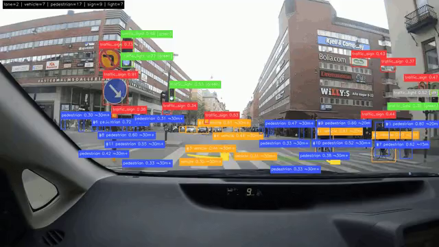
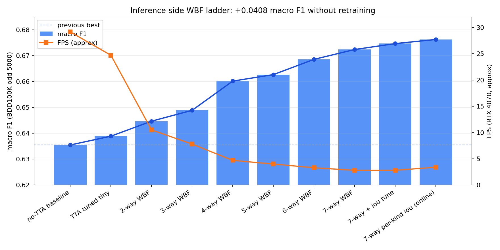

# adas-perception


A lightweight Python ADAS demo that detects **lanes, road users, traffic signs, and traffic lights** from a monocular dashcam and renders the results as JSON / video overlays.
A **rule-based planning overlay** can also be replayed from saved perception JSON.

**For research, demos, and education** — not for vehicle control or safety-critical use.

```bash
python3 -m venv .venv && source .venv/bin/activate
pip install -U pip && pip install -r requirements.txt -r requirements-yolo.txt
python scripts/demo_video.py --input path/to/drive.mp4 --output outputs/drive_adas.mp4
```

[](assets/demo_wbf7.mp4)

---

## What it does

| Area | Contents |
|---|---|
| Perception | YOLO object detection, lanes (OpenCV / ONNX), tracker, monocular distance, traffic light state |
| Planning | lane target, lead follow, traffic light stop/go, VRU yield, lane departure warning |
| Evaluation | BDD100K macro F1, WBF fusion, scenario YAML, pytest |

Macro F1 reference on BDD100K odd 5,000: **0.6355** (fast) → **0.6763** (7-way WBF online).
Detailed experiment logs and adoption decisions live in [PLAN.md](PLAN.md), direction in [ROADMAP.md](ROADMAP.md).



---

## Setup

```bash
python3 -m venv .venv
source .venv/bin/activate
pip install -U pip
pip install -r requirements.txt -r requirements-yolo.txt
pip install -e ".[dev]"          # for pytest
pip install -r requirements-bdd100k.txt   # for BDD100K evaluation / export (optional)
```

For CUDA, install a PyTorch build matching your environment first, then run the above.

---

## Quick start

### Video demo (default)

```bash
python scripts/demo_video.py \
  --input path/to/drive.mp4 \
  --output outputs/drive_adas.mp4 \
  --json-output outputs/drive.json
```

### Accuracy-priority / fast demo

| Use case | config | macro F1 reference |
|---|---|---|
| Accuracy priority (online WBF) | `configs/bdd100k_yolo_wbf7_perkind_iou_online.yaml` | 0.6763 |
| Single config + TTA | `configs/bdd100k_yolo_finetuned_all_tuned_split_img1024_kind_tuned_tta_tuned_tiny.yaml` | 0.6389 |
| Fast demo + post-NMS | `configs/bdd100k_yolo_kind_tuned_post_nms.yaml` | +0.0014 vs kind-only (proxy sweep) |
| Fast demo | `configs/bdd100k_yolo_finetuned_all_tuned_split_img1024_kind_tuned.yaml` | 0.6355 |

The weights `outputs/models/adas_yolov8n_bdd100k.pt` must be placed locally (not tracked by git).

### Web demo

```bash
pip install gradio
python scripts/web_demo.py
```

Upload images/videos from the browser UI to inspect detection results. Turning **Enable planning overlay** ON
also renders target path / behavior / warnings (research/demo use only).

### Planning overlay

**Quick demo** (bundled fixture, no GPU weights required):

```bash
python scripts/run_planning_demo.py \
  --video assets/demo_wbf7.mp4 \
  --output-dir outputs/planning_demo \
  --compare-configs \
  --export-benchmark
```

Outputs: `planning_frames.json`, `planning_overlay.mp4`, `driving_replay.json` (perception + planning combined)

**Perception → planning in one shot from a video** (with `outputs/models/adas_yolov8n_bdd100k.pt` in place; the post-NMS preset is the default):

```bash
python scripts/run_planning_demo.py \
  --run-perception \
  --video assets/demo_wbf7.mp4 \
  --max-frames 120 \
  --output-dir outputs/planning_demo_live
```

To fall back to the torchvision baseline that needs no extra weights:

```bash
python scripts/run_planning_demo.py \
  --run-perception \
  --perception-config configs/default.yaml \
  --video assets/demo_wbf7.mp4 \
  --output-dir outputs/planning_demo_torchvision
```

**Finetuned 1024px (post-NMS explicit)**:

```bash
python scripts/run_planning_demo.py \
  --run-perception \
  --perception-config configs/bdd100k_yolo_kind_tuned_post_nms.yaml \
  --video assets/demo_wbf7.mp4 \
  --output-dir outputs/planning_demo_post_nms
```

Maximum accuracy (WBF 7-way, heavy):

```bash
python scripts/run_planning_demo.py \
  --run-perception \
  --perception-config configs/bdd100k_yolo_wbf7_demo.yaml \
  --video assets/demo_wbf7.mp4 \
  --output-dir outputs/planning_demo_wbf7
```

Configs: `configs/planning/default.yaml` / `conservative.yaml` / `aggressive_demo.yaml`
Scenario evaluation: `python scripts/eval_planning_scenarios.py --scenarios-dir scenarios --output outputs/scenarios.json`

### Jetson / ONNX export

A lightweight preset that assumes exporting ONNX on a dev machine and building TensorRT on a Jetson device.

```bash
pip install -e ".[yolo]"
python scripts/export_yolo_onnx.py --imgsz 640 --write-manifest
python scripts/benchmark.py \
  --input assets/demo_wbf7.mp4 \
  --config configs/bdd100k_yolo_jetson_640_onnx.yaml \
  --max-frames 60
```

Example on the Jetson side:

```bash
trtexec --onnx=outputs/models/adas_yolov8n_bdd100k_640.onnx \
  --saveEngine=outputs/models/adas_yolov8n_bdd100k_640.engine --fp16
```

---

## BDD100K evaluation

**Fetch the val mirror** (Hugging Face, ~1GB):

```bash
python scripts/prepare_bdd100k.py --download-val --data-root data/bdd100k
```

**Evaluation example** (odd 5,000 report split):

```bash
python scripts/evaluate_bdd100k.py \
  --images-root data/bdd100k/images/100k/val \
  --labels data/bdd100k/labels/det_20/det_val.json \
  --config configs/bdd100k_yolo_finetuned_all_tuned_split_img1024_kind_tuned_tta_tuned_tiny.yaml \
  --device cuda \
  --frame-stride 2 --frame-offset 1 \
  --group-by-size \
  --output outputs/bdd100k_eval.json
```

### Retrain on the official train split (optional, can be skipped for now)

1. Get the train images + labels from the [official BDD100K site](https://bdd-data.berkeley.edu/)
2. Place them as follows:

```text
data/bdd100k/images/100k/train/
data/bdd100k/labels/det_20/det_train.json
data/bdd100k/images/100k/val/          # available via prepare --download-val
data/bdd100k/labels/det_20/det_val.json
```

3. Run:

```bash
bash scripts/bootstrap_bdd100k_official_train.sh
RUN_TRAIN=1 bash scripts/bootstrap_bdd100k_official_train.sh 10
```

If `adas_yolov8n_bdd100k.pt` is missing, fine-tuning starts from `yolov8n.pt`.

---

## Main scripts

| Script | Purpose |
|---|---|
| `scripts/demo_image.py` / `demo_video.py` | Image / video demos |
| `scripts/replay_planning_json.py` | perception JSON → planning JSON |
| `scripts/demo_planning_video.py` | Planning overlay video |
| `scripts/evaluate_bdd100k.py` | BDD100K evaluation |
| `scripts/evaluate_lane.py` | Lane detector comparison |
| `scripts/benchmark.py` | FPS / latency measurement |
| `scripts/export_yolo_onnx.py` | YOLO → ONNX export (for Jetson) |
| `scripts/prepare_bdd100k.py` | Data placement / validation |

---

## Directory layout (minimal)

```text
adas_perception/     # perception pipeline
adas_planning/       # rule-based planning
configs/             # YAML configs
scripts/             # CLI
scenarios/           # planning scenario YAML
tests/               # pytest
PLAN.md              # experiment log / next tasks (details here)
```

---

## Tests

```bash
pytest -q -k "not slow"
python scripts/eval_planning_scenarios.py --scenarios-dir scenarios --output outputs/scenarios.json
```

---

## Limitations

- Monocular distance and planning outputs are **rough estimates / recommendations** and do not imply real-vehicle ADAS performance
- `data/`, `outputs/`, `*.pt`, `*.onnx` are gitignored (large files)
- Long experiment changelogs are consolidated in [PLAN.md](PLAN.md), not the README

## License / data

When using BDD100K, follow the [official license](https://bdd-data.berkeley.edu/). Demo video footage: [Pexels CC0](https://www.pexels.com/video/dash-cam-view-of-the-road-5921059/).
